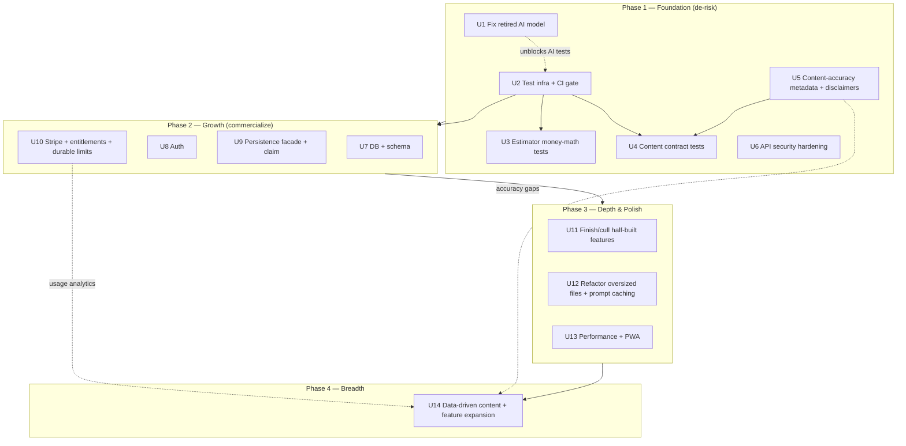

# feat: Maximize IronForge — comprehensive improvement roadmap

## Summary

IronForge is a Next.js 16 / React 19 app that walks ironworkers through launching a contracting business across all 50 states, with a Claude mentor, an estimator, a document vault, and 19 routes — built fast (the last big commit added 20 features at once) and now pointed at commercialization. The work below covers all four axes you asked for — foundation, growth, depth/polish, breadth — but **sequenced** so each phase de-risks the next: a trust-and-correctness foundation lands first, the paid foundation (auth/DB/billing) builds on a tested base, polish refines what exists, and breadth rides on data the earlier phases generate.

The sequencing is the engineering call. An app with zero tests, machine-generated regulatory advice for 48 states, money-math, and three AI endpoints should not stack billing and new features on an unverified base. The ordering is not "features last because they don't matter" — it's "features on a foundation that won't collapse under paying users."

One finding overrides the whole plan's start: the AI model the app hardcodes retired two days ago, so all three AI endpoints are returning 404s in production today. U1 fixes that before anything else.

---

## Problem Frame

The request was "maximize as much as possible to get this thing the best app out there." Confirmed scope: an executable plan covering every axis, not a narrowed subset.

What stands between IronForge and "best in its niche" is not breadth — it already has breadth. It is **trust**:

- **Zero automated tests** across ~26k LOC, with no lint/typecheck/test gate on PRs (CI runs only a CLA bot).
- **Regulatory content** is hand-crafted for WA + OR but **machine-generated for the other 48 states** — legal, licensing, bonding, and prevailing-wage facts a contractor will act on, with no `lastVerified`/`source` metadata and no "not legal advice" surface.
- **Money-math** in the estimator runs unclamped and untested, with rule-of-thumb constants hardcoded inline.
- **Three Claude endpoints** are exposed, and the model they call is retired as of 2026-06-15.
- **Commercialization** (Neon + Stripe) is planned and blueprinted but not built; persistence is localStorage-only.

The plan turns each of these into a sequenced, testable unit of work.

---

## Requirements

Grouped by axis. These trace to the implementation units that satisfy them.

**Foundation — trust & correctness**
- R1. The AI endpoints must call a current, supported Claude model and stop 404ing. (U1)
- R2. The repo must have a test runner, a baseline suite for high-risk logic, and a CI gate that blocks merges on lint/typecheck/test failure. (U2)
- R3. The estimator's money-math must be covered by deterministic tests and reject invalid (negative/NaN) input. (U3)
- R4. Every state must be proven to render valid, non-empty content through every phase, with no silent fallback to another state's data. (U4)
- R5. State regulatory data must carry verification metadata, and every state-facing page must show a "not legal advice / verify with your state" disclaimer and a last-verified date. (U5)
- R6. All three AI routes must enforce origin/CSRF and rate limiting; security headers must be defined in one place. (U6)

**Growth — make it sellable** *(executes `docs/commercialization/05-migration-plan-neon-stripe.md`)*
- R7. Persistent, multi-device storage backed by a real database, without losing any existing user's localStorage data. (U7, U9)
- R8. User accounts with auth, gating persistence and premium features but never the wizard itself. (U8)
- R9. Subscription billing (founding-lifetime + monthly) with a single entitlement check and idempotent webhook handling. (U10)

**Depth & polish**
- R10. No half-built features shipped as "coming soon"; the 20 rapid-expansion features are audited and either finished or removed. (U11)
- R11. Oversized files are split per the project's own 300-line rule, and the AI system prompts use prompt caching to cut cost. (U12)
- R12. The app meets a performance/PWA bar (Lighthouse, bundle size, canvas-effect cost) on mid-tier mobile. (U13)

**Breadth**
- R13. New content depth and features are prioritized using analytics and content-accuracy signals the earlier phases produce, not guessed. (U14)

---

## Key Technical Decisions

- **Sequence foundation → growth → polish → breadth.** The de-risking order is the core decision. Rationale in Summary; the alternative (growth-first) is treated in Alternatives Considered.

- **AI model targets.** Migrate off the retired `claude-sonnet-4-20250514`. Per the Claude API migration guide, its drop-in replacement is `claude-sonnet-4-6`. Recommended tiering: wizard chat mentor → `claude-sonnet-4-6` (fast, cheap, `max_tokens: 1024`); bid-review's 13-section contract analysis → `claude-opus-4-8` (depth matters, low volume); onboarding → `claude-sonnet-4-6`. Model IDs are exact strings, no date suffixes. (U1)

- **Test runner: Vitest.** Matches the ESM / TS-strict / Tailwind-v4-no-config posture and the migration plan's TS-native preference. Playwright for the wizard E2E + SSE streaming path. (U2)

- **Content accuracy is a type-system change, not a doc convention.** Add `lastVerified` / `sourceUrl` / `effectiveDate` to the content types so the data model enforces what `CONTRIBUTING.md` currently only requests socially. (U5)

- **Growth executes the existing migration blueprint as-is.** `docs/commercialization/05-migration-plan-neon-stripe.md` already specifies Neon + Drizzle + Auth.js v5 + Stripe, a persistence facade, and a `/claim` migration flow. The growth units (U7–U10) point at that document rather than re-deriving it; deviations are called out where they touch foundation work. (U7–U10)

- **Durable rate limiting deferred to Growth.** The in-memory per-instance limiter is a real serverless gap, but a durable limiter (e.g. Upstash) needs the infra that arrives with Neon. U6 hardens what's possible now (extend CSRF/origin to all routes, dedupe headers); the durable limiter lands in U10's hardening per the migration plan.

---

## High-Level Technical Design

The phases form a dependency chain — each depends on the testable base the prior one establishes. Breadth is the only phase that loops back on data the others generate.



Diagram is authoritative for sequencing intent. U1 is independent and ships immediately (production is broken); the rest of Phase 1 follows the test-infra spine.

---

## Output Structure

New directories introduced (Growth phase), alongside existing `app/`, `components/`, `content/`, `lib/`:

```
ironforge/
├── lib/
│   ├── db/                  # Drizzle schema + client (U7)
│   ├── auth/                # Auth.js config, entitlements (U8, U10)
│   ├── validation/          # shared isValidX guards hoisted from lib/store/* (U9)
│   └── store/persistence.ts # Local | Server | Hybrid facade (U9)
├── app/api/
│   ├── state/               # profile, progress, chat, store, migrate, export, delete (U9)
│   └── billing/             # checkout, portal, webhook (U10)
├── tests/                   # Vitest unit/integration; Playwright e2e (U2)
├── auth.ts                  # Auth.js v5 entrypoint (U8)
└── .github/workflows/ci.yml # lint + typecheck + test gate (U2)
```

Per-unit `Files:` lists are authoritative; this tree is the scope shape.

---

## Implementation Units

### U1. Fix the retired AI model across all three routes

- **Goal:** Restore AI functionality — migrate off the retired `claude-sonnet-4-20250514` to current models so chat, bid-review, and onboarding stop 404ing.
- **Requirements:** R1
- **Dependencies:** none (ship immediately)
- **Files:** `app/api/chat/route.ts`, `app/api/bid-review/route.ts`, `app/api/onboarding/route.ts`
- **Approach:** Swap the model string in each route per KTD tiering (chat/onboarding → `claude-sonnet-4-6`, bid-review → `claude-opus-4-8`). Run the Claude API migration checklist per route: confirm no last-assistant-turn prefill, no `temperature`/`top_p`/`top_k`, no `budget_tokens` (all 400 on current models). Sonnet 4.6 defaults effort to `high`; the chat route runs without a `thinking` field, which is correct for a fast mentor — leave thinking off. Keep streaming (already in place). Centralize the model IDs in one constant module so the next migration is a one-line change.
- **Patterns to follow:** existing `client.messages.stream(...)` shape in `app/api/chat/route.ts`; the server-side step lookup pattern (never trust client step content) stays unchanged.
- **Execution note:** Verify against the real API before claiming done — a 404 on the old ID and a 200 on the new one is the proof.
- **Test scenarios:**
  - Happy path: a valid chat request returns a streamed `text/event-stream` response (not a 404/503). Covers R1.
  - Each route references a model ID present in the current model catalog (assert against the centralized constant).
  - Error path: with a malformed model constant, the route surfaces the existing scrubbed 500, not a raw SDK error.
  - Regression: bid-review still wraps the contract in `<contract>` data tags; onboarding still parses without sending raw user text as instructions.

### U2. Stand up test infrastructure + CI gate

- **Goal:** A Vitest runner, a Playwright harness, and a GitHub Actions workflow that blocks merges on lint/typecheck/test failure.
- **Requirements:** R2
- **Dependencies:** none
- **Files:** `vitest.config.ts`, `package.json` (scripts + devDeps), `.github/workflows/ci.yml`, `tests/setup.ts`, `playwright.config.ts`
- **Approach:** Add Vitest + `@testing-library/react` + jsdom for unit/component tests, Playwright for E2E. Wire `npm test`, `npm run test:e2e`. CI runs `npm run lint`, `npx tsc --noEmit`, `npm test` on PR. Tighten the near-empty ESLint flat config to extend the Next.js rules. Seed one trivial passing test per layer so the harness is proven before U3/U4 fill it.
- **Patterns to follow:** `package.json` script conventions; `CONTRIBUTING.md` quality-gate language.
- **Test expectation:** none — this unit *is* the test harness. Verification is that a sample unit test, a sample component test, and a sample Playwright test all run green in CI, and a deliberately broken test fails the CI job.
- **Verification:** CI status check appears on a PR and goes red when a test fails.

### U3. Cover and harden the estimator money-math

- **Goal:** Deterministic tests for the cost calculator; reject negative/NaN inputs; extract magic-number constants.
- **Requirements:** R3
- **Dependencies:** U2
- **Files:** `lib/estimator/calculate.ts`, `lib/estimator/constants.ts` (new), `lib/estimator/calculate.test.ts` (new), `components/estimator/estimator-form.tsx`
- **Approach:** Extract the inline rule-of-thumb constants (burden %, bolts $/ton, profit %, contingency, bonding) into a named, documented constants module. Clamp inputs at the calculation boundary (negatives → 0), not just via the HTML `min` hint. Golden-file tests pin known input→output pairs so a constant change is a visible diff. Review the compounding order (profit + contingency applied on a subtotal that already includes bonding-on-marked-up-subtotal) and document the intended order as a test.
- **Patterns to follow:** the documented constant header comment already in `lib/estimator/calculate.ts`; the `Number.isFinite` guard in `estimator-form.tsx`.
- **Test scenarios:**
  - Happy path: a representative project (tonnage, complexity, state) produces the expected total to the cent (golden file).
  - Edge: zero tonnage → zero or floor cost, never NaN; a prevailing-wage state vs non-PW state changes burden as expected.
  - Error path: a manually-typed negative weight is clamped to 0, not propagated into the total.
  - Edge: a monopolistic-WC state pulls the correct WC handling from the registry.
  - Compounding: profit and contingency apply in the documented order; a fixture locks it so reordering breaks the test.

### U4. Content contract tests + fix the silent state fallback

- **Goal:** Prove every state renders valid, non-empty content through every phase, and remove the path that silently serves Washington data for a missing state.
- **Requirements:** R4
- **Dependencies:** U2, U5 (metadata shape)
- **Files:** `content/phases.ts`, `content/phases.test.ts` (new), `content/generators/*.ts`, `lib/types/content.ts`
- **Approach:** Generated test iterating all 50 `STATE_REGISTRY` codes × every phase getter, asserting each returns a valid `Phase` with non-empty `steps` and well-formed `Step` shapes. Replace the `getStateData` fallback that returns Washington content on a missing state with an explicit error or a clearly-labeled "data unavailable for this state" state — never another state's regulatory facts presented as this state's.
- **Patterns to follow:** the WA/OR-vs-generator routing in `content/phases.ts`; the `isValidX` validator style in `lib/store/*`.
- **Test scenarios:**
  - Happy path: for all 50 states, every phase resolves to a non-empty, schema-valid `Phase`. Covers R4.
  - Edge: a state with thin registry data still produces valid (if sparse) content, not a crash and not WA's content.
  - Error path: an unknown state code throws or returns the labeled-unavailable state, asserted explicitly — never a silent WA fallback.
  - Integration: the chat route's server-side step lookup finds the same steps the wizard renders, for a sampled state × phase × step.

### U5. Content-accuracy metadata + legal disclaimers

- **Goal:** Make verification a first-class field on the data model, and surface "not legal advice" + a last-verified date on every state-facing page.
- **Requirements:** R5
- **Dependencies:** none (U4 consumes the new shape)
- **Files:** `lib/types/content.ts`, `content/state-registry.ts`, `content/generators/*.ts`, `components/wizard/*` (disclaimer surface), `content/shared/legal-resources.ts`
- **Approach:** Add `lastVerified` (ISO date), `sourceUrl`, and optional `effectiveDate` to `StateData` and/or `Step`. Backfill WA/OR with real values; mark generated states with a conservative `lastVerified` and a generic state-agency `sourceUrl`. Render a persistent, non-dismissable "Not legal advice — verify with your state agency" banner plus the last-verified date on state content. This is the regulatory-liability posture the launch checklist already calls for.
- **Patterns to follow:** the `CURRENT_*_VERSION` / `DEFAULT_*` colocated-constant style in `lib/types/vault.ts`; `CONTRIBUTING.md` source-URL-and-date convention (now schema-enforced).
- **Test scenarios:**
  - Happy path: a state page renders the disclaimer and a last-verified date.
  - Edge: a state missing `lastVerified` shows a clear "verification pending" state rather than a blank or a fake date.
  - Contract: every `StateData` entry has the new required fields populated (asserted in the U4 content suite).

### U6. API security hardening (what's possible pre-infra)

- **Goal:** Extend origin/CSRF enforcement to all three AI routes and define security headers in one place.
- **Requirements:** R6
- **Dependencies:** none
- **Files:** `proxy.ts`, `next.config.ts`, `app/api/bid-review/route.ts`, `app/api/onboarding/route.ts`
- **Approach:** `proxy.ts` (the Next.js 16 middleware equivalent) currently applies the origin/CSRF check and rate limiter to `/api/chat` only. Extend the same origin check to `/api/bid-review` and `/api/onboarding`. Reconcile the duplicate header sets — `next.config.ts` ships a weaker static set while `proxy.ts` ships the full CSP/HSTS; consolidate to one source of truth (prefer the `proxy.ts` set, which includes CSP and HSTS). Note in code that the in-memory limiter is per-instance and that the durable replacement lands in U10.
- **Patterns to follow:** the existing `addSecurityHeaders` and origin-check logic in `proxy.ts`.
- **Execution note:** Characterize current behavior with a test first — assert chat is protected and bid-review/onboarding are not — then extend.
- **Test scenarios:**
  - Happy path: a same-origin POST to each AI route succeeds.
  - Error path: a cross-origin POST (mismatched `Origin`) to chat, bid-review, and onboarding all return 403.
  - Edge: a request missing `Origin`/`Host` is rejected, matching the chat route's current behavior.
  - Regression: security headers (CSP, HSTS, X-Frame-Options) appear exactly once per response.

### U7. Database + schema (Neon + Drizzle)

- **Goal:** Provision Neon and define the Drizzle schema. Executes Phase 1 of `docs/commercialization/05-migration-plan-neon-stripe.md`.
- **Requirements:** R7
- **Dependencies:** Phase 1 (test infra in place)
- **Files:** `lib/db/schema.ts`, `lib/db/index.ts`, `drizzle.config.ts`, `lib/db/schema.test.ts` (new)
- **Approach:** Implement the schema from the migration plan verbatim (users, userProfiles, stepProgress, chatMessages, userStores, subscriptions, billingEvents, waitlist, Auth.js adapter tables). Generate and apply migrations. Note the vault store holds base64 file data and needs blob/object storage, not a JSON column (per the migration plan's hardening section).
- **Patterns to follow:** `docs/commercialization/05-migration-plan-neon-stripe.md` §1.1.
- **Test scenarios:**
  - Happy path: migrations apply cleanly to a fresh Neon dev branch; a seed user round-trips.
  - Edge: `stepProgress` composite PK rejects duplicate (user, phase, step) rows.
  - Integration: a `userStores` JSON blob persists and reads back validated.

### U8. Authentication (Auth.js v5)

- **Goal:** Email magic-link + Google OAuth, database sessions, with the wizard staying public. Executes Phase 2 of the migration plan.
- **Requirements:** R8
- **Dependencies:** U7
- **Files:** `auth.ts`, `app/api/auth/[...nextauth]/route.ts`, `app/signin/page.tsx`, `app/account/page.tsx`, `proxy.ts` (protect `/account`, not `/wizard`)
- **Approach:** Per migration plan §2. Database session strategy (instant revoke). `/wizard/*` stays anonymous to protect the organic funnel; only account/persistence routes are gated.
- **Patterns to follow:** migration plan §2; existing `proxy.ts` matcher.
- **Test scenarios:**
  - Happy path: magic-link sign-in creates a user + session row.
  - Edge: an anonymous user can complete the entire wizard with no prompt to sign in.
  - Error path: an unauthenticated request to `/account` redirects to sign-in; to `/wizard` does not.
  - Integration: sign-out invalidates the database session immediately.

### U9. Persistence facade + one-click localStorage migration

- **Goal:** A Local/Server/Hybrid persistence facade and a `/claim` flow that migrates a user's localStorage to the DB on first sign-in with zero data loss. Executes Phase 3 of the migration plan.
- **Requirements:** R7
- **Dependencies:** U7, U8
- **Files:** `lib/store/persistence.ts` (new), `lib/store/*.ts` (route through facade), `lib/validation/*` (hoisted `isValidX` guards), `app/api/state/*` (profile, progress, chat, store, migrate, export, delete), `app/claim/page.tsx`
- **Approach:** Per migration plan §3. Hoist the existing `isValidX` validators into `lib/validation/` so both the stores and the `/api/state/migrate` endpoint share them. Component code keeps calling `loadUserState()` unchanged; the facade decides local vs server. Keep old localStorage keys for 30 days as a rollback net. Normalize the inconsistent key naming (snake/kebab/colon) during migration. Honor the conflict policy (keep-server default with merge option).
- **Patterns to follow:** the two divergent store patterns in `lib/store/progress.ts` vs `lib/store/vault.ts` — reconcile them through the facade; migration plan §3.
- **Execution note:** Characterization tests for the existing store load/save behavior before refactoring through the facade — these stores are load-bearing and untested.
- **Test scenarios:**
  - Happy path: a signed-in user's localStorage (profile, progress, chat, vault, etc.) migrates to the DB and reads back identically.
  - Edge: an empty localStorage migrates to a valid empty server state, no error.
  - Error path: a migration validation failure surfaces the raw JSON + a download button and does not wipe local data.
  - Conflict: existing server data + local data triggers the three-option dialog; default keeps server.
  - Integration: after migration, the facade flips to ServerPersistence and the next write hits the DB, not localStorage.
  - Edge: the vault's base64 documents migrate within the size budget or fail loudly, never silently truncate.

### U10. Stripe billing, entitlements, and durable rate limits

- **Goal:** Founding-lifetime + monthly SKUs, a single entitlement check, idempotent webhooks, and the durable rate limiter. Executes Phases 4–5 of the migration plan.
- **Requirements:** R9, R6 (durable limiter)
- **Dependencies:** U7, U8, U9
- **Files:** `app/api/billing/checkout/route.ts`, `app/api/billing/portal/route.ts`, `app/api/billing/webhook/route.ts`, `lib/auth/entitlements.ts`, `proxy.ts` / rate-limit module
- **Approach:** Per migration plan §4–5. Webhook on Node runtime with raw-body signature verification; entitlement derived from the `subscriptions` table, never from a webhook alone; every event idempotent on Stripe event id. Free tier keeps the full wizard with an AI message cap. Replace the in-memory limiter with a durable one (Upstash or equivalent) now that infra exists.
- **Patterns to follow:** migration plan §4 (checkout/webhook/entitlements) and §5.3 (rate limits).
- **Test scenarios:**
  - Happy path: `checkout.session.completed` sets the user's tier and creates a subscription row.
  - Edge: a replayed webhook event (same Stripe event id) is a no-op (idempotency).
  - Error path: a webhook with a bad signature is rejected before any DB write.
  - Edge: `customer.subscription.deleted` downgrades to free at period end, respecting `cancel_at_period_end`.
  - Entitlement: a free user hits the AI message cap and is blocked; a pro user is not.
  - Rate limit: the durable limiter enforces a global limit across simulated multiple instances, unlike the in-memory one.

### U11. Finish or cull half-built features

- **Goal:** Remove "coming soon" stubs by finishing or deleting them; audit the 20 rapid-expansion features for completeness.
- **Requirements:** R10
- **Dependencies:** Phase 2 complete
- **Files:** `app/wizard/summary/page.tsx` (export feature), `lib/ai/onboarding-parser.ts` (dead `"d.c."` alias), plus an audit pass across the feature routes
- **Approach:** Implement the wizard summary export (JSON/CSV download) or remove the disabled buttons. Fix the dead DC state alias that the code admits never resolves. Audit each of the 19 routes for stubs, dead handlers, and shallow features; finish, cut, or file as deferred.
- **Patterns to follow:** existing export/download patterns elsewhere in the app; the markdown-renderer for any generated artifact.
- **Test scenarios:**
  - Happy path: the wizard summary exports a valid file (JSON and CSV) with the user's real progress.
  - Edge: export with no progress yields a valid empty-but-well-formed file.
  - Error path: the DC alias resolves to a real state code or is removed; no path leaves it unresolved.

### U12. Refactor oversized files + AI prompt caching

- **Goal:** Split files over the project's 300-line rule and add prompt caching to the AI routes.
- **Requirements:** R11
- **Dependencies:** Phase 2 complete (so refactors don't collide with growth work)
- **Files:** `app/wizard/[phase]/[step]/page.tsx` (617 lines; extract SSE parsing + store orchestration), `components/onboarding/onboarding-chat.tsx`, `components/starter-kit/starter-kit-content.tsx`, `components/capability/cap-statement-form.tsx`, `app/page.tsx`, `components/estimator/estimator-form.tsx`, `app/api/*/route.ts` (caching)
- **Approach:** Extract the manual SSE-parsing logic in the wizard page into a reusable hook/util; split the 500+ line components into focused pieces. Add `cache_control` to the stable prefix of the AI system prompts (shared educational content + phase content are large and stable; the per-request user data goes after the breakpoint) to cut input cost — the system prompts are well over the cacheable minimum.
- **Patterns to follow:** the `lib/hooks/use-voice-input.ts` hook pattern; the prompt-caching prefix-stability rule (stable content before the breakpoint, volatile after).
- **Execution note:** These are behavior-preserving refactors — lean on the U2/U9 tests to prove no regression. Add a characterization test for the SSE parser before extracting it.
- **Test scenarios:**
  - The extracted SSE parser produces the same message assembly as the inline version for a recorded stream (happy path + a mid-stream `[DONE]` + an error frame).
  - Each split file stays under the 300-line guideline; the page renders identically (component test).
  - Caching: `usage.cache_read_input_tokens` is non-zero on the second identical-prefix AI request (cache is actually hitting).

### U13. Performance + PWA polish

- **Goal:** Hit a measurable performance bar on mid-tier mobile.
- **Requirements:** R12
- **Dependencies:** U12
- **Files:** `components/ui/matrix-rain.tsx`, `components/ui/tron-grid.tsx`, `content/state-registry.ts` (2818-line load path), `public/sw.js`, `next.config.ts`
- **Approach:** Profile the canvas effects (matrix rain / tron grid) and throttle or disable them on low-power devices / `prefers-reduced-motion`. Check whether the 2818-line registry is shipped whole to the client or code-split per state; lazy-load per-state data if it's bloating the bundle. Audit the hand-rolled service worker's caching strategy. Set a Lighthouse target and bundle-size budget in CI.
- **Patterns to follow:** existing PWA registration in `components/ui/pwa-register.tsx`.
- **Test scenarios:**
  - Performance: Lighthouse performance score meets the agreed target on a throttled mobile profile (E2E/CI check).
  - Edge: `prefers-reduced-motion` disables the canvas animations.
  - Regression: the service worker still serves the offline fallback and doesn't cache stale API responses.
  - Bundle: per-route JS stays under the budget; a regression fails CI.

### U14. Data-driven content depth + feature expansion

- **Goal:** Expand content accuracy/coverage and add features, prioritized by real signal rather than guesswork.
- **Requirements:** R13
- **Dependencies:** Phase 3 complete; consumes analytics from U10 and accuracy gaps from U5
- **Files:** `content/<state>/*` (new hand-crafted states), `content/state-registry.ts`, plus feature work TBD by priority
- **Approach:** Use the `lastVerified` metadata (U5) to rank which generated states most need hand-crafting, and the usage analytics (U10) to rank which states/features users actually hit. Hand-craft the highest-traffic, lowest-confidence states first (the WA/OR treatment). Specific new features are deliberately left to be chosen against this data — see Open Questions.
- **Patterns to follow:** the hand-crafted `content/washington/*` and `content/oregon/*` structure; preserve the hand-crafted-vs-generated split per `CONTRIBUTING.md`.
- **Test scenarios:**
  - Each newly hand-crafted state passes the U4 content contract suite and carries real `lastVerified`/`sourceUrl` values.
  - A newly hand-crafted state's content differs from (improves on) its generated version (regression guard against accidental generator fallback).
  - Edge: any new feature ships with its own test scenarios per this plan's standard — none ship untested.

---

## Alternatives Considered

- **Growth-first (auth + DB + Stripe before tests/accuracy).** Tempting because revenue is the visible goal and the migration plan is ready. Rejected as the default: billing and multi-tenant persistence built on an untested base with unverified regulatory content multiplies the blast radius of every bug, and a paying customer acting on wrong state data is a liability event, not a support ticket. Foundation-first makes the growth work safer and is only marginally slower. If you want revenue sooner, the lightest defensible reorder is U1 + U2 + U5 (the model fix, a thin test spine, and the legal disclaimer) before starting Growth — that covers the highest-liability gaps without the full Phase 1.

- **Defer breadth indefinitely.** Considered dropping U14 entirely. Rejected because you explicitly asked for all axes; instead breadth is sequenced last and made data-driven so it isn't guesswork.

- **Big-bang commercialization rewrite.** Rejected in favor of the migration plan's six incremental, feature-flagged, individually-shippable phases — same reasoning the plan author already documented.

---

## Risk Analysis & Mitigation

| Risk | Likelihood | Impact | Mitigation |
|---|---|---|---|
| AI endpoints already broken (retired model) | Certain (now) | High | U1 ships first, independent of everything else |
| User acts on wrong machine-generated state data | Medium | High (legal) | U5 disclaimers + verification metadata; U4 removes silent WA fallback; U14 hand-crafts high-risk states |
| localStorage migration loses user data | Low | High | 30-day local retention + download-on-failure + shared validators (migration plan §3) |
| Refactors (U12) silently change behavior | Medium | Medium | Characterization tests (U9, U12) before extraction; CI gate (U2) |
| Stripe webhook sets wrong tier | Medium | High | Idempotent on event id; entitlement derived from `subscriptions` table (U10) |
| In-memory rate limit ineffective on serverless | High | Medium | Acknowledged in U6; durable limiter in U10 |
| Scope fatigue across 14 units | High | Medium | Phases are independently shippable; stop after any phase boundary with a coherent product |

---

## Scope Boundaries

**In scope:** all four axes as sequenced units U1–U14.

### Deferred to Follow-Up Work
- Admin CMS for the state registry (migration plan calls this a separate epic).
- Converting JSON-blob stores to fully relational tables (migration plan §5.1 — post-launch hardening).
- Observability stack (pino/Sentry/dashboards) beyond what U10 needs — migration plan §5.2.
- A second trade vertical (electrical) and mobile-native app — migration plan "out of scope."
- Specific new breadth features beyond content depth — chosen against U10/U5 data (see Open Questions).

### Outside this effort's identity
- Anything that gates the wizard itself behind auth or payment — the anonymous funnel is load-bearing and stays free.

---

## Open Questions

- **Model spend vs quality on bid-review.** `claude-opus-4-8` gives the best contract analysis but costs more; confirm the volume justifies Opus over Sonnet 4.6 there. (Resolvable with U10 usage data; defaulting to Opus for low-volume, high-value analysis.)
- **Performance target for U13.** What Lighthouse score / bundle budget is the bar? Proposed: 90+ performance on a throttled mobile profile.
- **Breadth priorities (U14).** Which new features matter most — deeper per-state content, a second trade, richer estimator, BIM/PM features? Deferred deliberately until U5/U10 data exists; revisit at the Phase 3→4 boundary.
- **Founding-member pricing/cap.** The migration plan assumes $299 lifetime / $49 mo / 500 seats — confirm before U10.

---

## Sources & Research

- `docs/commercialization/05-migration-plan-neon-stripe.md` — the authoritative growth blueprint; U7–U10 execute it.
- Claude API model catalog + migration guide (via the `claude-api` reference) — confirmed `claude-sonnet-4-20250514` retired 2026-06-15 and the `claude-sonnet-4-6` / `claude-opus-4-8` targets and migration checklist for U1.
- Repository research (architecture, test-infra absence, security posture, content-engine flow, persistence model) — grounds U2–U6, U11–U13.
- `CONTRIBUTING.md` — the 300-line file rule, source-URL/date convention (U5, U12), and hand-crafted-vs-generated content split (U14).
